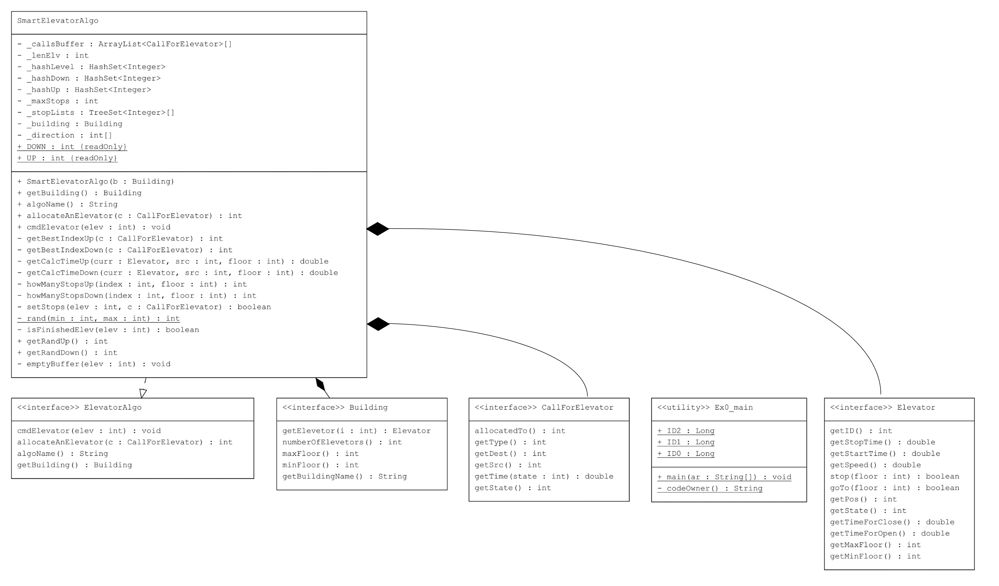

# OOP-Task1
the second task of oop course - offline elevators

### Students
Gilad livshitz & Batel Cohen

[@giladliv](https://github.com/giladliv "@giladliv") & [@BatelCohen7](https://github.com/BatelCohen7 "@BatelCohen7")

## Simulator (Bonus)
this is the video of the run of our simulator:
[Gilad's And Batel's Elevator Simulator](https://youtu.be/iZcspYH_p3k "Gilad's And Batel's Elevator Simulator") - https://youtu.be/iZcspYH_p3k

Please make sure that you visit our Simulator (Runs the same as Ex1.py): <a href="Ex1/src/ElevatorSimulator.py">ElevatorSimulator.py</a>


## About elevators

### links
First of all there are some intresting links that helped us to understand more about how elevators are functioning, and through them we got some insperation

- [DUPLEX elevator call logic](http://https://www.youtube.com/watch?v=oY1QlCqWOss "DUPLEX elevator call logic")
- [Elevator Call Logic](https://www.youtube.com/watch?v=BCN9mQOT3RQ "Elevator Call Logic")
- [Smart Elevators App](https://youtu.be/yzLxHEkXY5Q "Smart Elevators App")
- [Elevators - the Next Generation](https://www.youtube.com/watch?v=WEQ71bA8hQk "Elevators - the Next Generation")

The previous task (Ex0 - as it was submitted) is here at this link: <a href="https://github.com/giladliv/OOP-Task0.git">Ex0 Github Link</a>

## On-line vs. Off-line

Until this project we were assuming that elevators only reach to their source and destination at the moment we press the button, But now we see that it is more comleceted then that. Further more, now we are acknolaged that due to the technological advantage we can nowpick the destination floor from the source floor and moreover, there are apps that can help us scedual forward calls - those eleberate elevators commonly knon as "Smart Elevator".
let us differ the 2 way to call an elevator, a smart one. We will explian the logic and algorithm behind them.

### Online Algorithm
Online is the more common algorithm nowadays.
the Online way is to deal with call at the moment they are being called, they are more "live" then the other way.
For Example: I am up to attend a meeting int 5 minutes at floor 59, I am currently at the Lobby level (the floor 0). There are other peaple at diffrent levels, assumed to be a guy named "Mathew", he wants to go from the 3rd flr to the 55th flr, other, "Jane Doe" is as level 47 and want to reach the -2 floor (the Parking-lot).
The elevators will calculate for each call, the shortest and the safest the route from their current floor to their destinations.

<a name="online_exp"></a>
#### How are they doing that?
This is OUR algorithm:
1. The elevetors are sorted by: 
	- goes up
	- gous down
	- resting elevators
2. For each new call tat recived we check the direction of the call (if goes up or down)
3. We runs on all of the elevators that has the same direction or in resting mode.
**Note 1:** if all the elevator are allocated with the same direction we will let one elevator to be for the other direction.
**Note 2:** we choose the first elevator to be comapared by random, we ensure this action, that of the all elevators have got allocated
4. For Each elevator we check if the source and destination floors are in the bounderies of itself, olso we check if it doesn't reached to the maximum stops that it capable to have (the maximum stops is the range of theelevator (high floor - low floor)).
5. We now compare the elevators by who has the lowes time ro reach from its current position to the source floor and then from the source floor to the destination floor.
	*curr postition ----> source floor ----> destination floor*
6. After we found our winner elevator, we will save those sourc and destination floors as the stops of the elevator (in sorted way: up - regularly, down- reversed)

#### Online Solution Design



#### Results - online
```
Case,0,  Total waiting time: 235.9897426188186,  average waiting time per call: 23.59897426188186,  unCompleted calls,1,  certificate, -675652664
Case,1,  Total waiting time: 401.9897426188186,  average waiting time per call: 40.19897426188186,  unCompleted calls,5,  certificate, -1431989115
Case,2,  Total waiting time: 6389.792822120196,  average waiting time per call: 63.897928221201965,  unCompleted calls,8,  certificate, -2250125245
Case,3,  Total waiting time: 23270.53828433313,  average waiting time per call: 58.17634571083283,  unCompleted calls,3,  certificate, -1885689780
Case,4,  Total waiting time: 28094.455368642088,  average waiting time per call: 56.188910737284175,  unCompleted calls,3,  certificate, -1954468862
Case,5,  Total waiting time: 136976.12115705173,  average waiting time per call: 136.97612115705172,  unCompleted calls,36,  certificate, -4743262737
Case,6,  Total waiting time: 93828.8820969485,  average waiting time per call: 93.82888209694849,  unCompleted calls,18,  certificate, -3116642605
Case,7,  Total waiting time: 275113.12115705176,  average waiting time per call: 275.11312115705175,  unCompleted calls,74,  certificate, -16423214849
Case,8,  Total waiting time: 210815.8820969488,  average waiting time per call: 210.8158820969488,  unCompleted calls,39,  certificate, -7410625776
Case,9,  Total waiting time: 79486.34007431248,  average waiting time per call: 79.48634007431248,  unCompleted calls,8,  certificate, -2871005606
```

### Offline Algorithm
This mode is diffrent, assumed to be an app that links the phone to the elevator, we can scadual a call to pick us at wanted moment.
The offline mode gets all the future calls, and when they are excpected to be made.

#### How are they doing that?
The Base algorithm is very similar to the Online mode [(read more about online algorithm)](#online_exp).
The big diffrence, that in the online being handled live while the offline mode only give the allocation.
OUR algorithm work like that:
1. For each new call simulate all the elevtors movments, run then to the given time stamp
2. perform as the [(online algorithm)](#online_exp) for each call, and set the best allocation for thus elevator

#### Results
```
Building:1, Calls: a :: Total waiting time: 11292.0,  average waiting time per call: 112.92,  unCompleted calls,0,  certificate, -276000130
Building:1, Calls: b :: Total waiting time: 1784243.6402240375,  average waiting time per call: 1784.2436402240376,  unCompleted calls,963,  certificate, -4320440287
Building:1, Calls: c :: Total waiting time: 1839360.3121899734,  average waiting time per call: 1839.3603121899735,  unCompleted calls,958,  certificate, -4662242705
Building:1, Calls: d :: Total waiting time: 1841698.4976999543,  average waiting time per call: 1841.6984976999543,  unCompleted calls,950,  certificate, -4714308913
Building:2, Calls: a :: Total waiting time: 5782.0,  average waiting time per call: 57.82,  unCompleted calls,0,  certificate, -214258795
Building:2, Calls: b :: Total waiting time: 1783484.6402240375,  average waiting time per call: 1783.4846402240375,  unCompleted calls,963,  certificate, -4323348836
Building:2, Calls: c :: Total waiting time: 1837974.3121899734,  average waiting time per call: 1837.9743121899735,  unCompleted calls,958,  certificate, -4655515835
Building:2, Calls: d :: Total waiting time: 1840475.4976999543,  average waiting time per call: 1840.4754976999543,  unCompleted calls,950,  certificate, -4709414788
Building:3, Calls: a :: Total waiting time: 4296.0,  average waiting time per call: 42.96,  unCompleted calls,0,  certificate, -266076112
Building:3, Calls: b :: Total waiting time: 543481.1207680005,  average waiting time per call: 543.4811207680004,  unCompleted calls,266,  certificate, -1766820374
Building:3, Calls: c :: Total waiting time: 606086.2405200074,  average waiting time per call: 606.0862405200074,  unCompleted calls,264,  certificate, -2049495482
Building:3, Calls: d :: Total waiting time: 565111.0294020068,  average waiting time per call: 565.1110294020068,  unCompleted calls,247,  certificate, -1924914931
Building:4, Calls: a :: Total waiting time: 1983.0,  average waiting time per call: 19.83,  unCompleted calls,0,  certificate, -77066297
Building:4, Calls: b :: Total waiting time: 312538.5765120012,  average waiting time per call: 312.5385765120012,  unCompleted calls,94,  certificate, -1196769428
Building:4, Calls: c :: Total waiting time: 291829.89226499974,  average waiting time per call: 291.8298922649997,  unCompleted calls,73,  certificate, -1016207874
Building:4, Calls: d :: Total waiting time: 287681.67718200164,  average waiting time per call: 287.68167718200164,  unCompleted calls,77,  certificate, -1013387110
Building:5, Calls: a :: Total waiting time: 1739.0,  average waiting time per call: 17.39,  unCompleted calls,0,  certificate, -67180307
Building:5, Calls: b :: Total waiting time: 45062.0,  average waiting time per call: 45.062,  unCompleted calls,0,  certificate, -238938887
Building:5, Calls: c :: Total waiting time: 43765.0,  average waiting time per call: 43.765,  unCompleted calls,0,  certificate, -262606433
Building:5, Calls: d :: Total waiting time: 45792.0,  average waiting time per call: 45.792,  unCompleted calls,0,  certificate, -238938887
```